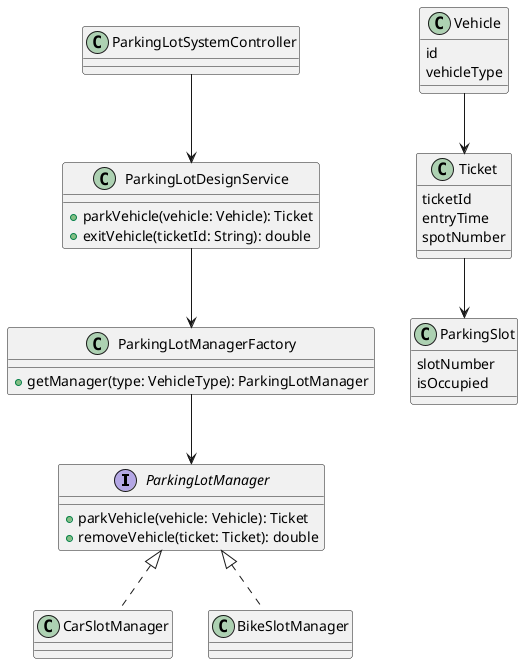

# Parking Lot System – Low Level Design (Spring Boot)

## 📌 GitHub Repository Description

A **Spring Boot based Parking Lot System** demonstrating clean Low-Level Design (LLD) principles, Factory Pattern usage, and extensible vehicle-based slot management. The project models real-world parking operations such as slot allocation, ticket generation, and cost calculation, making it ideal for **LLD interviews, system design practice, and backend learning**.

---

## 🧠 Problem Statement

Design a parking lot system that:

* Supports different vehicle types (Car, Bike)
* Allocates and frees parking slots
* Generates parking tickets
* Calculates parking cost
* Exposes APIs to interact with the system

The design should be **scalable, extensible, and follow SOLID principles**.

---

## 🏗️ Architecture Overview

**Pattern Used**

* Factory Pattern (Slot Manager selection)
* Service Layer abstraction
* Model-driven domain design

**High Level Flow**

1. Client hits REST API
2. Controller delegates to Service
3. Service selects appropriate ParkingLotManager via Factory
4. Manager allocates slot / generates ticket
5. Cost is calculated when vehicle exits

---

## 🧩 Core Components

### Controller Layer

* `ParkingLotSystemController`

    * Entry point for all parking operations

### Service Layer

* `ParkingLotDesignService`

    * Orchestrates parking operations
* `TicketGenerator`

    * Generates parking tickets
* `CostCalculator`

    * Calculates parking cost

### Factory Layer

* `ParkingLotManagerFactory`

    * Returns appropriate manager based on `VehicleType`

### Manager Layer

* `ParkingLotManager` (interface)
* `CarSlotManager`
* `BikeSlotManager`

### Model Layer

* `Vehicle`
* `VehicleType`
* `ParkingSlot`
* `SpotDetails`
* `Ticket`

---

## 📐 UML Class Diagram (PlantUML)

> You can render this using IntelliJ, VS Code extension, or plantuml.com



---

## 🔌 API Endpoints

| Method | Endpoint                | Description                   |
| ------ | ----------------------- | ----------------------------- |
| POST   | `/park`                 | Park a vehicle                |
| POST   | `/exit`                 | Exit vehicle & calculate cost |
| GET    | `/getSlotStatus`        | Get status of a slot          |
| GET    | `/getParkingSlotStatus` | Get full parking lot status   |

---

## 🛠️ Tech Stack

* Java 17
* Spring Boot
* Gradle
* REST APIs
* JUnit (basic test setup)

---

## 🚀 How to Run

```bash
./gradlew bootRun
```

Application runs on:

```
http://localhost:8080
```

---

## ✅ Improvements You Can Add (Future Scope)

* Multiple floors support
* Dynamic pricing strategy
* Persistence (DB)
* Concurrency handling
* Strategy Pattern for pricing
* Swagger / OpenAPI

---

## 🎯 Learning Outcomes

* Real-world LLD implementation
* Factory Pattern usage
* Clean separation of concerns
* Interview-ready design

---

## 👨‍💻 Author

**Harsh Bhoyar**
Java Developer | System Design Enthusiast

---

⭐ If you find this useful, give it a star and feel free to fork & enhance!
